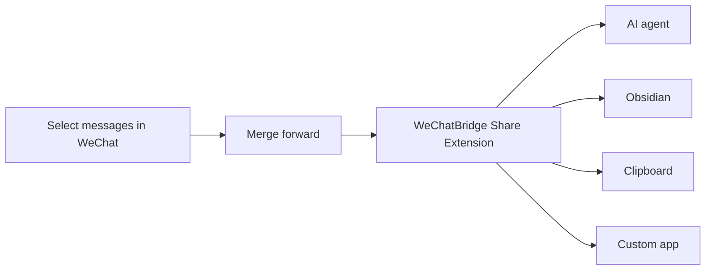
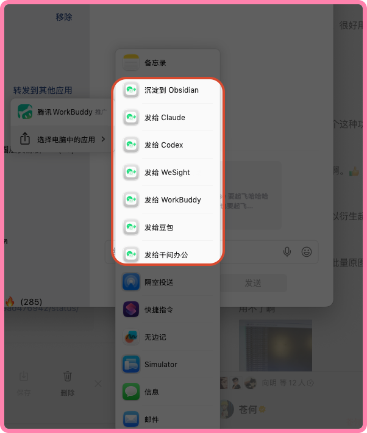
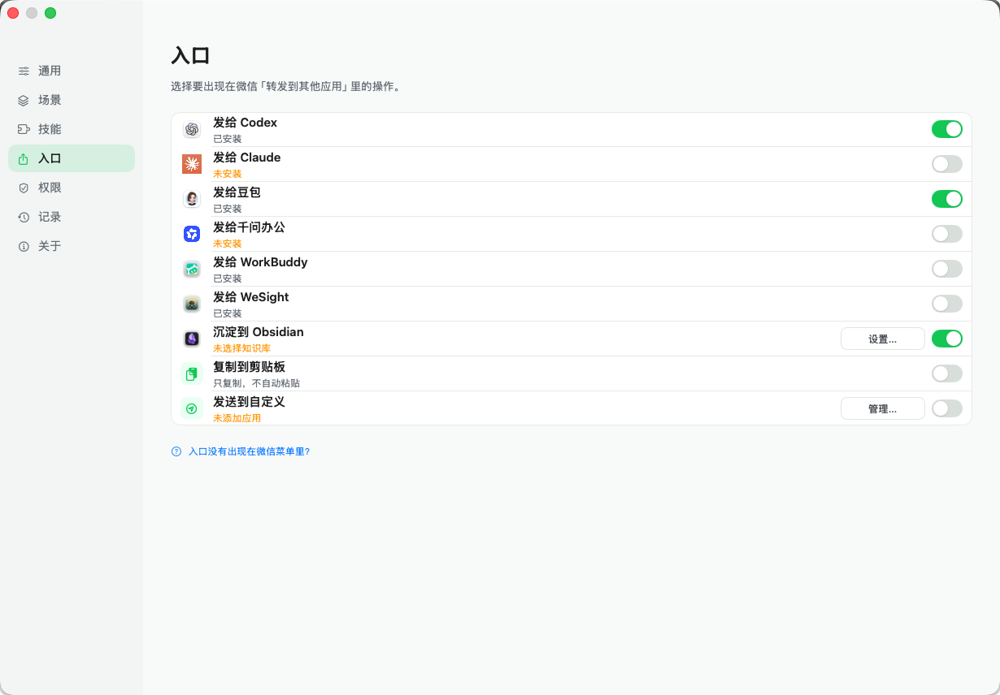
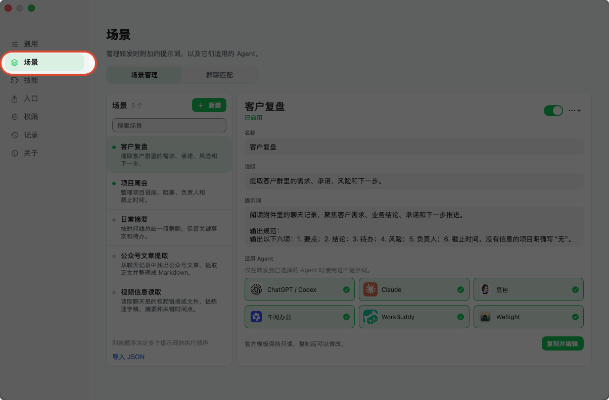
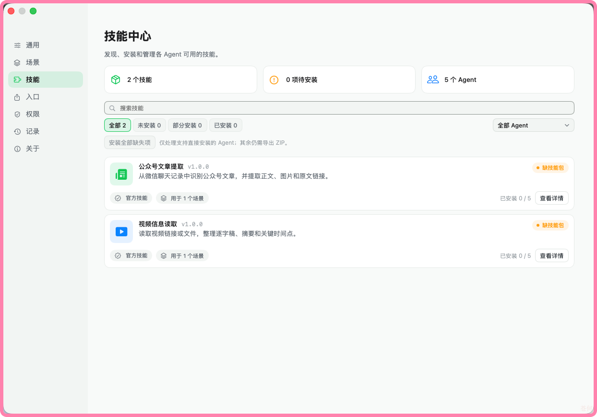

<div align="center">
  
  <h1>WeChatBridge (微信流)</h1>
  <p><strong>Send WeChat conversations to AI agents and local knowledge bases from the native share menu.</strong></p>
  <p>A native, lightweight, fully local WeChat hand-off and archiving tool for macOS.</p>

  <p>
    <a href="https://github.com/freestylefly/WeChatBridge/actions/workflows/ci.yml"></a>
    <a href="https://github.com/freestylefly/WeChatBridge/releases/latest"></a>
    
    
    <a href="LICENSE"></a>
  </p>

  <p><a href="README.md">简体中文</a> · English</p>
  <p><a href="https://render.qmuse.pub/p/muse/2413870555736078">Website · render.qmuse.pub</a></p>
</div>

> [!NOTE]
> The Developer ID-signed and Apple-notarized [WeChatBridge 0.1.14 DMG](https://github.com/freestylefly/WeChatBridge/releases/latest) is now available.

## Why WeChatBridge

WeChat 4.1.13 for macOS introduced merged forwarding to third-party apps. It exports selected messages as a ZIP containing an ordered text transcript, images, and videos—a useful input format for AI agents and local knowledge bases.

The macOS “forward to other apps” menu only lists apps that ship a Share Extension. WeChatBridge adds that missing layer and routes one export to Codex, Claude, Doubao, QwenWork, WorkBuddy, WeSight, Obsidian, the clipboard, or another app you choose.



## Highlights

| Capability | Experience |
| --- | --- |
| Nine native entries | Pick a destination in WeChat without opening the main app |
| AI agent hand-off | Activate the target app, attach a scene prompt, and paste the archive |
| Obsidian archiving | Create a Markdown note, retain the original ZIP, and organize it by chat name |
| Custom destinations | Add any macOS app; terminal-style apps can receive file paths only |
| Scenes and skills | Keep prompts per conversation and manage agent-compatible `SKILL.md` packages |
| Local history | Inspect delivery state, retry, copy, reveal files, and clean old batches |
| Safe fallback | Files remain on the clipboard when an app or permission is unavailable |
| Bilingual UI | Simplified Chinese and English throughout |

### Built-in destinations

| Entry | Behavior |
| --- | --- |
| Send to Codex | Activate ChatGPT/Codex and paste the conversation archive |
| Send to Claude | Activate Claude and paste the conversation archive |
| Send to Doubao | Activate Doubao and paste the conversation archive |
| Send to QwenWork | Activate QwenWork and paste the conversation archive |
| Send to WorkBuddy | Activate WorkBuddy and paste the conversation archive |
| Send to WeSight | Activate WeSight and paste the conversation archive |
| Save to Obsidian | Create a Markdown note and preserve the original attachment |
| Copy to Clipboard | Keep the files ready for a manual paste |
| Send to Custom | Route the batch to an app from your own list |

## In action

Pick a destination straight from WeChat's “Forward to other apps” menu, without opening the main window first:

<div align="center">
  
</div>

<table>
  <tr>
    <th align="center">Destination switches</th>
    <th align="center">Scenes</th>
  </tr>
  <tr>
    <td align="center"></td>
    <td align="center"></td>
  </tr>
  <tr>
    <td align="center"><sub>Toggle any of the nine entries; missing apps are flagged</sub></td>
    <td align="center"><sub>Scenes store prompts and their agents, chosen at forward time</sub></td>
  </tr>
  <tr>
    <th align="center">Skill Center</th>
    <th align="center">Saving to Obsidian</th>
  </tr>
  <tr>
    <td align="center"></td>
    <td align="center"></td>
  </tr>
  <tr>
    <td align="center"><sub>Install capability packs so agents can read links and videos</sub></td>
    <td align="center"><sub>Notes keep the original archive and render attachments like WeChat does</sub></td>
  </tr>
</table>

Full steps, permissions, and troubleshooting live in the [usage guide](USAGE_EN.md).

## Privacy by design

- Conversation content only comes from files explicitly exported by WeChat.
- The app does not read WeChat databases, decrypt data, inject code, or modify WeChat.
- Archives, scenes, and history stay on the Mac.
- Every Share Extension runs inside the macOS sandbox without network access.
- Screen Recording is used only to recognize the chat name in WeChat's title bar; images are processed in memory.
- Accessibility is used only to activate a destination and perform the paste action.
- The update path is reserved for GitHub Releases; automatic checks are currently disabled in the source configuration.

## Requirements

- macOS 14 Sonoma or later
- Xcode 16 or Command Line Tools with Swift 6 support
- Accessibility permission for automatic paste
- Screen Recording permission for chat-name recognition

## Download

Download the latest DMG from [GitHub Releases](https://github.com/freestylefly/WeChatBridge/releases/latest), open it, and drag WeChatBridge into Applications. The package supports both Apple Silicon and Intel Macs.

## Build from source

```bash
git clone https://github.com/freestylefly/WeChatBridge.git
cd WeChatBridge
swift test
CONFIG=release Scripts/make-app.sh
```

The app is assembled at `dist/微信流.app`. Install it into the current user's Applications directory and register its Share Extensions with:

```bash
Scripts/install-dev-build.sh
```

Open “WeChatBridge → Settings → Entries” and enable the destinations you want. They can also be managed in “System Settings → General → Login Items & Extensions → Sharing.”

> [!TIP]
> Local builds prefer an Apple Development or Developer ID identity from your keychain. When no certificate is available, the build uses ad-hoc signing and macOS may ask you to grant Accessibility again.

## Project layout

```text
Sources/
├── WeChatBridgeApp/      # Main app, settings, routing, and permissions
├── WeChatBridgeCore/     # Batches, scenes, archives, and clipboard logic
└── WeChatBridgeShare/    # macOS Share Extension
Resources/                # Artwork, plists, entitlements, and bundled skills
Scripts/                  # Build, install, signing, and release tooling
Tests/                    # Swift Testing / XCTest coverage
site/                     # Sparkle update feed and release notes
```

Swift Package Manager owns the source layout and the Sparkle dependency. `Scripts/make-app.sh` assembles the host executable and nine Share Extensions into a complete `.app` bundle.

## Development checks

```bash
# Run tests
swift test

# Validate Simplified Chinese and English resources
swift Scripts/check-localizations.swift

# Check signing metadata, bundle identifiers, app group, and release configuration
Scripts/check-release-config.sh

# Build, install, and open a development copy
Scripts/dev-preview.sh
```

## Contributing

Issues and pull requests are welcome:

1. Check [Issues](https://github.com/freestylefly/WeChatBridge/issues) for an existing discussion.
2. Fork the repository and create a focused branch from `main`.
3. Keep changes scoped and add tests for behavior changes.
4. Run `swift test` and the localization check before submitting.
5. Describe the motivation, verification, and any visual changes in the pull request.

Please report security issues privately through [GitHub Security Advisories](https://github.com/freestylefly/WeChatBridge/security/advisories/new). Avoid posting sensitive details in a public issue.

## Roadmap

- [x] Native merged-forward support from WeChat
- [x] Codex, Claude, Doubao, QwenWork, WorkBuddy, and WeSight
- [x] Local Obsidian archiving
- [x] Scene prompts and skill management
- [x] Universal 2 build, signing, and notarization pipeline
- [x] First public DMG release
- [ ] Homebrew Cask
- [ ] More community scenes and skill packages

## Community Group

Join the WeChatBridge community group to share workflows, exchange tips, and report issues with developers and other users.

<div align="center">
  
  <br />
  <sub>Scan with WeChat to join the community group</sub>
</div>

## About Us

Follow project updates, join the discussion, or contact us on WeChat by searching for “数字生命蜗牛” or “苍何”.

<table>
  <tr>
    <th align="center">数字生命蜗牛</th>
    <th align="center">苍何</th>
  </tr>
  <tr>
    <td align="center"></td>
    <td align="center"></td>
  </tr>
</table>

## License

WeChatBridge is released under the [MIT License](LICENSE).

## Acknowledgements

- [Dukou (渡口)](https://github.com/qzz0518/Dukou): WeChatBridge is built on this project.
- [Sparkle](https://github.com/sparkle-project/Sparkle) provides secure update delivery for the macOS app.
- Thanks to everyone who tested the app, shared feedback, and contributed code.

<div align="center">
  <sub>If WeChatBridge helps your workflow, consider leaving a ⭐️ so more people can discover it.</sub>
</div>
