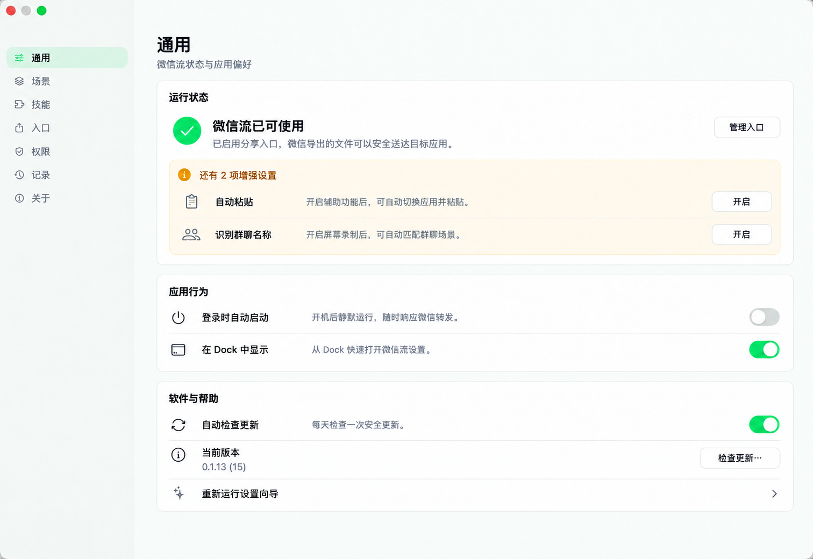

# 通用页：运行总览

## 页面目标

让用户先确认「微信流现在能不能用」，再处理增强能力和低频偏好。核心链路只要求至少一个分享入口可用；辅助功能、屏幕录制、场景和技能不阻塞整体就绪状态。

## 交互

- **管理入口**：进入「入口」页。
- **自动粘贴 · 开启**：请求辅助功能权限；系统拒绝或曾被拒绝时改为「打开系统设置」。
- **识别群聊名称 · 开启**：请求屏幕录制权限；系统拒绝或曾被拒绝时改为「打开系统设置」。
- **登录时自动启动**：沿用当前登录项开关及 `requiresApproval` 提示。
- **在 Dock 中显示**：立即切换应用的 Dock 可见性。
- **自动检查更新**、**检查更新…**：沿用当前 Sparkle 行为和不可用状态。
- **重新运行设置向导**：整行可点击，从向导第一步开始。

## 状态变化

| 条件 | 顶部结论 | 操作 |
|---|---|---|
| 至少一个入口可用 | 微信流已可使用 | 管理入口 |
| 没有入口可用 | 还差一步即可使用 | 开启分享入口 |
| 增强项未开启 | 保持绿色就绪结论，仅显示待完成项 | 就地开启或进入系统设置 |
| 增强项全部开启 | 隐藏待完成区域 | 无 |

权限缺失是增强项，不使用错误红色；只有实际读取失败或系统操作失败才显示错误状态。
