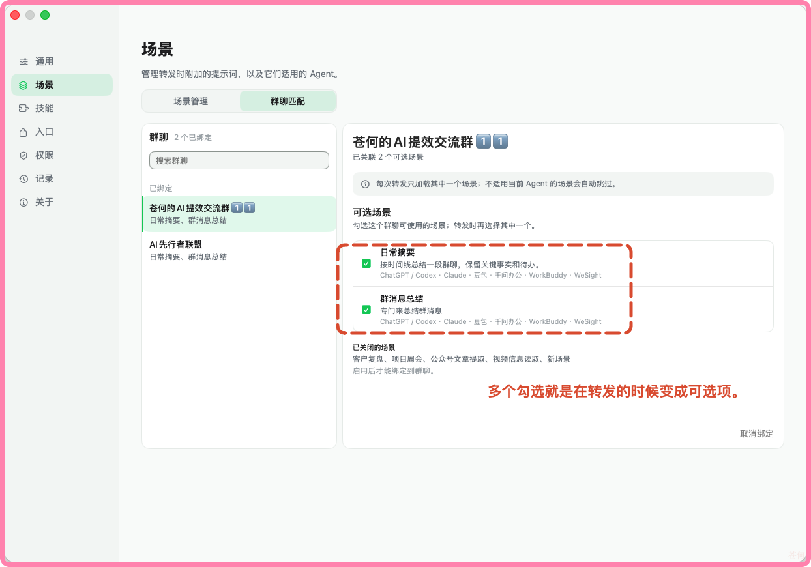
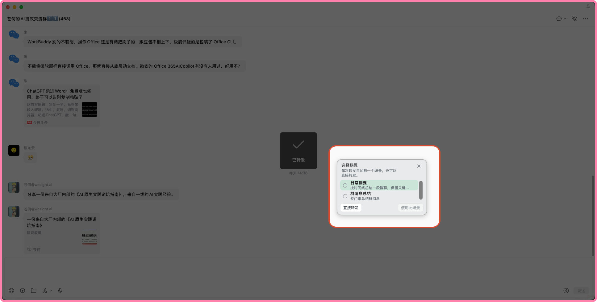
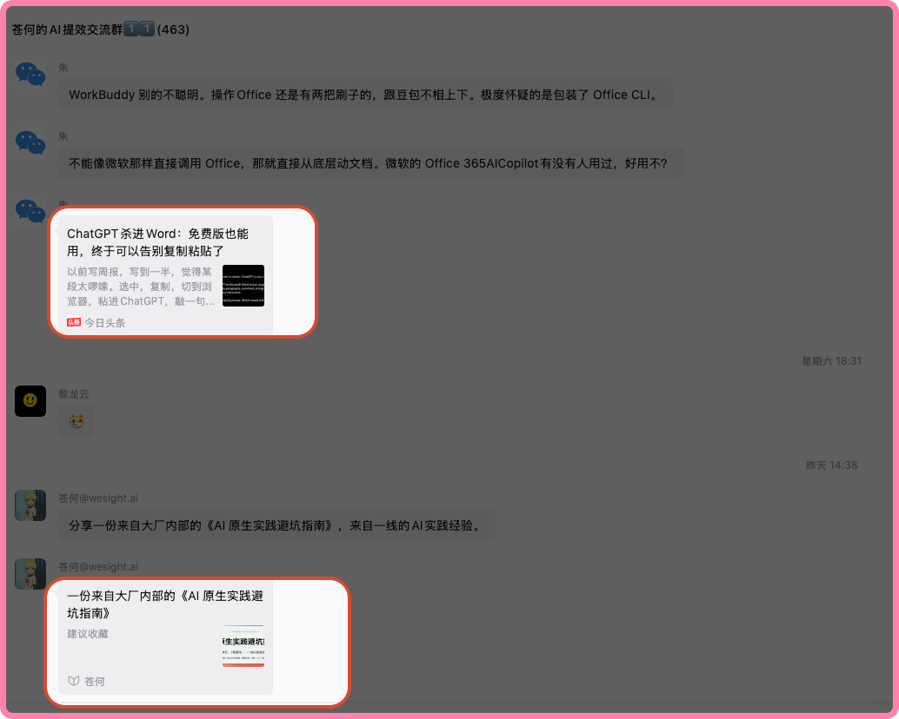
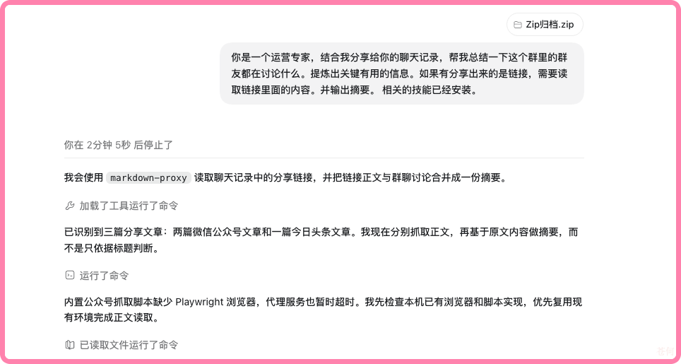
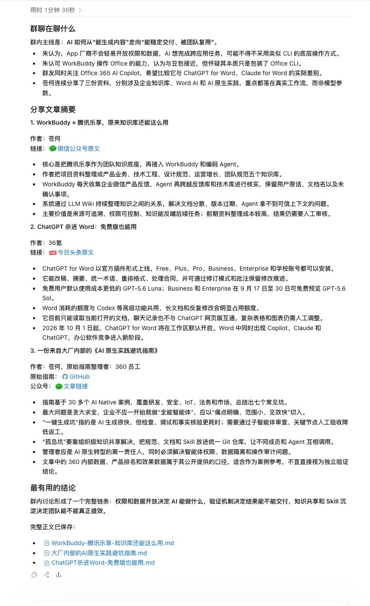
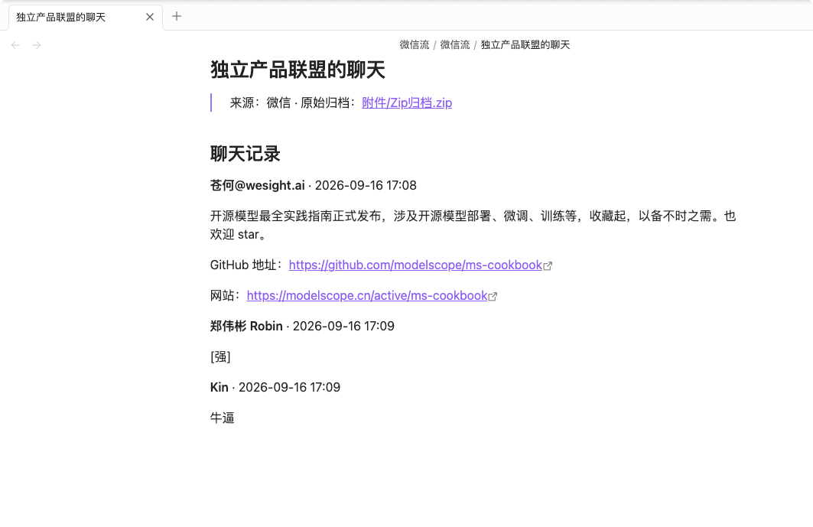
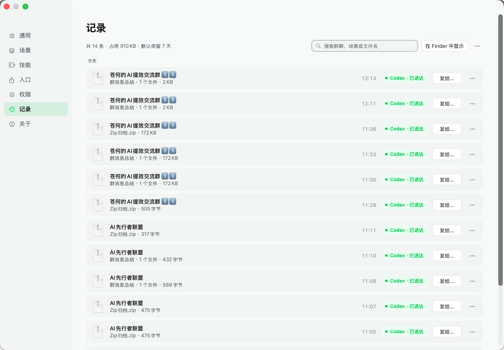

# 微信流使用指南

微信流接在微信原生的「多选 → 合并转发」之后。你照常在微信里选中聊天记录、选择「转发到其他应用」，菜单里会多出一排微信流提供的入口。点选之后，微信流负责把聊天归档和整理要求送到目标应用，或者整理成一篇 Obsidian 笔记。

这篇文档按实际使用顺序，把每个功能怎么用、界面上是什么样子讲一遍。

- 安装、构建与系统要求见 [README](README.md)
- 完整能力清单与明确不做的边界见 [产品能力文档](PRODUCT_CAPABILITIES.zh-CN.md)

## 三步完成一次转发

1. 在「设置 → 入口」里打开需要的入口开关。只有打开过的入口才会出现在微信菜单里。
2. 在微信中多选聊天记录，使用「合并转发」→「转发到其他应用」。
3. 在列表里点选目标，例如「发给 Codex」。微信流会激活目标应用，写入聊天归档，并把场景提示词和内容粘贴进去。

这排入口由微信流提供，和微信原有的隔空投送、信息、邮件排在同一个菜单里，选中即完成一次投递。

## 转发入口

九个入口覆盖主流 Agent、笔记软件和剪贴板，随时可以用开关收窄或放开。

「入口」页里每个条目都会显示当前状态：未安装的应用会标注出来，Obsidian 会提示是否已选择知识库，自定义入口会提示已添加几个应用。开关关掉之后，对应入口立刻从微信菜单里消失。

支持的 Agent 图标：

- 发给 Codex / Claude / 豆包 / 千问办公 / WorkBuddy / WeSight：激活目标应用并粘贴聊天归档。
- 沉淀到 Obsidian：生成 Markdown 笔记，同时保存微信导出的原始压缩包。
- 复制到剪贴板：只写文件，不自动粘贴，由你自己决定贴到哪里。
- 发送到自定义：添加任意 macOS 应用，终端类应用可以只接收文件路径。

## 场景化：把整理要求提前写好

场景是一段提示词加上它适用的 Agent。写好之后，每次转发只需要挑一个场景，整理要求自动跟着聊天记录一起送过去。

场景里可以写清输出规范，例如「先提取客户需求、承诺和风险，再给出下一步」。每个场景还能限定只在某些 Agent 上启用，转发到其他应用时自动跳过。

群聊可以绑定多个场景，做到一个群一套说法。

绑定之后，转发时会弹出场景选择框，挑一个再发出去；也可以跳过选择直接转发。

典型的用法是把客户群配成「客户复盘」、项目群配成「项目周会」、资讯群配成「日常摘要」，之后不用每次再解释一遍要 Agent 做什么。

## 技能中心

技能是安装到 Agent 侧的 `SKILL.md` 能力包。场景负责说明要什么，技能负责让 Agent 真的会做。

以群聊里常见的公众号链接为例。群里一天分享好几篇文章，逐个点开太费时间。

转发时带上「公众号文章提取」技能，Agent 会先抓取正文再输出摘要，你挑感兴趣的继续深读。

## 沉淀到 Obsidian

选择「沉淀到 Obsidian」后，微信流按聊天名生成笔记，记录来源和原始归档，聊天内容按时间顺序展开。

附件按微信聊天界面的样式渲染，图片、文件、链接都能直接看出原来长什么样，翻笔记的时候不用再去对照原始压缩包。

## 记录

「记录」页保存每一次转发的批次，显示目标应用和送达状态，方便确认文件到底有没有送到。

一个批次可以重新发送到其他应用，也可以复制、在访达中定位或清理。默认保留 7 天。

## 权限与失败兜底

微信流只需要两个系统权限，都用在你主动发起的转发上：

1. 辅助功能：激活目标应用并执行粘贴。
2. 屏幕录制：识别微信标题栏里的聊天名，用于匹配群聊场景。图像只在内存里处理。

权限没给、目标应用没装、粘贴失败时，文件都会留在剪贴板，不会丢。也可以直接用「复制到剪贴板」入口手动粘贴。

## 安全边界

| 评估维度 | 数据库解密型工具 | 微信流 |
| --- | --- | --- |
| 实现原理 | 逆向工程与内存注入，Hook 微信进程读取数据库密钥，解密本地 `.db` 文件 | 复用微信原生的多选、打包、转发流程，用辅助功能与剪贴板完成应用间投递 |
| 账号风险 | 注入进程容易触发风控特征，存在封号与功能受限风险 | 对微信而言与人工转发无异，不触发风控 |
| 数据范围 | 拿到密钥后可静默扫描全部联系人与群聊 | 只处理你在界面上主动选中的那几条记录，仅在本机处理 |
| 版本稳定性 | 依赖内存偏移，微信每次发版都可能失效 | 不依赖微信内部实现细节，微信更新后照常可用 |
| 场景契合 | 离线批量导出归档 | 面向 AI 工作流，支持带提示词直接投递到 Codex、Claude、Obsidian 等 |

聊天内容只来自微信主动导出的文件。微信流不读取微信数据库，不解密，不注入微信进程，Share Extension 运行在沙盒中且没有网络权限。更多细节见 [SECURITY.md](SECURITY.md)。

## 常见问题

**入口没有出现在微信菜单里？**
先确认对应开关已打开，再到「系统设置 → 通用 → 登录项与扩展 → 共享」里检查扩展是否启用。系统有时需要重启微信才会刷新菜单。

**目标应用没有装？**
入口页会直接标注未安装。装上之后再打开开关即可，不需要重新安装微信流。

**转发过去只有文件，没有自动粘贴？**
检查辅助功能权限是否授予。权限缺失时文件仍在剪贴板，手动粘贴即可。
