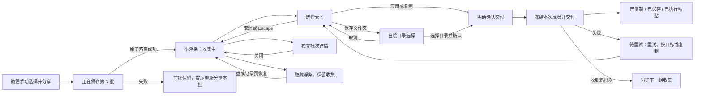
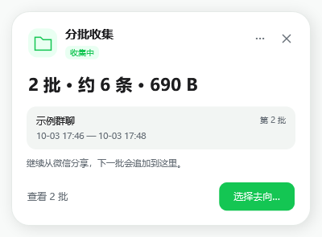
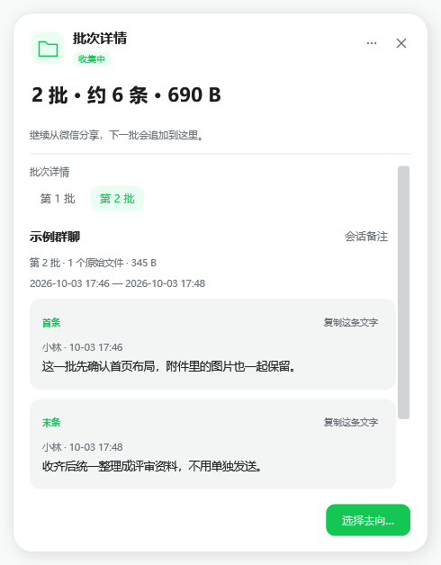
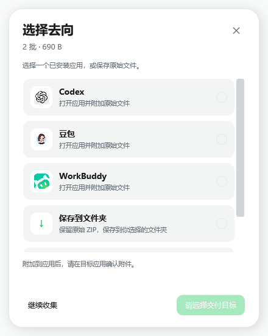
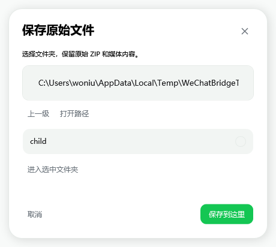

# Windows 分批收集：交互设计 V2

日期：2026-10-04。交互图确认后已实现 Windows 收集浮条、独立批次详情、交付面板、自绘目录选择及确认面板。组件位于 windows/src/WeChatBridge.Windows/Components，保存阶段通过 CollectionImportProgress 通知主程序。

## 核心路径

## 三个任务界面

1. **收集浮条**：固定小尺寸；收集状态、已收批数、估算消息数、大小与最近批次。只有「查看 N 批」和「选择去向」。自动接收不抢微信焦点；没有预计总量，不画完成百分比。
2. **批次详情**：独立面板，浮条不膨胀。切换批次，默认显示首条、末条，其余定位参考折叠。会话备注可选；编辑时可明确保存或取消，可明确将备注用于未命名和后续批次，不覆盖已有备注。识别当前微信只能由用户显式触发。
3. **交付面板**：只列出已安装应用，另有复制文件和保存到文件夹。目标单选；只有适用应用目标才显示场景。明确按钮随目标变化：附加到应用、复制 N 个文件、保存 N 个文件。

## 交互边界

- 备注不是经过验证的会话身份，缺少备注不能阻断原始文件交付。
- 关闭、隐藏和取消不删除、不清空、不结束收集；交付取消不冻结成员。
- 交付按钮点击后才冻结本次快照；新收到批次进入新组，不污染快照。
- 移出只解除本组归属；文件仍保留在记录页。操作后提供局部撤销，并可从更多菜单再次进入撤销。
- 删除至回收站使用自绘确认面板，明确文件范围；默认焦点在取消，不让 Enter 意外删除。
- 复制文件、保存文件和执行粘贴各自显示真实结果；执行粘贴不代表上传或发送成功。
- 保存失败只影响这一批；交付失败保留整组，可重试、复制或换目标。

## 自定义组件

| 组件 | 行为与状态 |
| --- | --- |
| 收集卡片与状态标记 | 保存中、收集中、待发送、交付中、待重试 |
| 按钮与图标按钮 | 主操作、次操作、悬停、按下、禁用、键盘焦点 |
| 批次切换器 | 选中态、消息摘要、批次多时可滚动 |
| 会话备注输入 | 占位文本、编辑、保存、取消、可选批量应用 |
| 自绘勾选与折叠参考 | 清晰选中态、键盘操作、展开/收起 |
| 目标卡片 | 应用图标、操作说明、单选标记 |
| 场景选择浮层 | 自绘下拉、搜索/选择、键盘焦点 |
| 滚动条 | 细轨道、自绘滑块、拖动与滚轮 |
| 操作菜单 | 普通操作与危险操作分组 |
| 文件夹选择面板 | 最近目录、路径输入、子目录列表、取消与确认 |
| 提示与确认面板 | 局部反馈、撤销、重试、危险操作确认 |

所有组件统一圆角、间距与字级，颜色直接复用主程序 AppTheme.xaml，覆盖 320 px 窄屏、放大文字、Tab/Enter/Escape 与辅助功能；不采用系统默认控件外观。

## 设计图文件

- [交互流程源图](assets/batch-collection-windows-v2/interaction-flow.svg)
- [页面布局源图](assets/batch-collection-windows-v2/screen-storyboard.svg)

以下截图使用测试 ZIP 和临时 Inbox，展示实际 WPF 渲染结果，颜色直接复用主程序主题。

