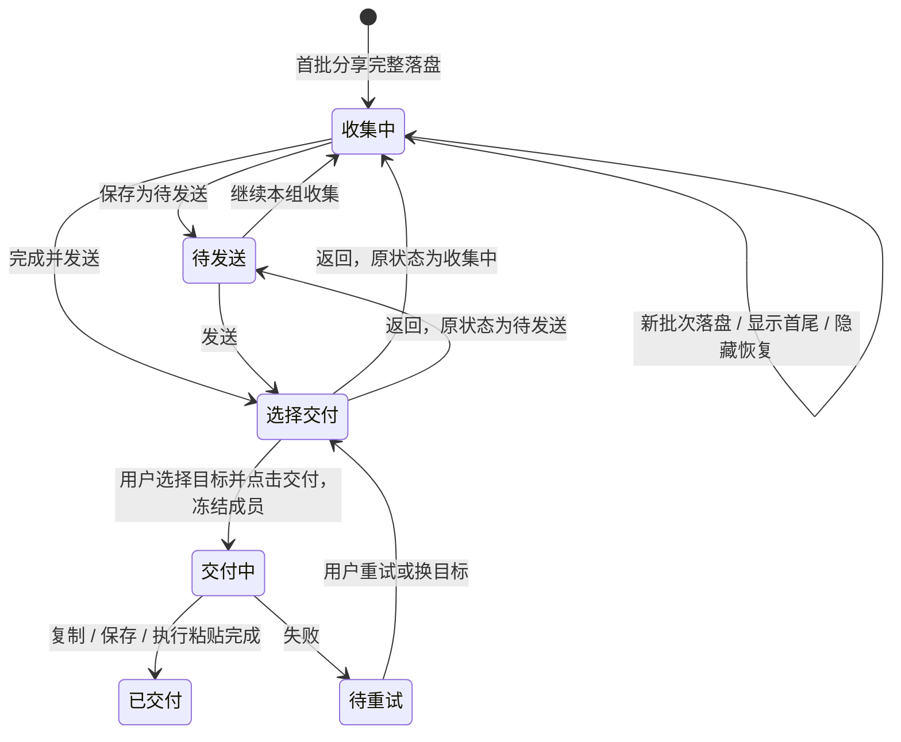

# 分批收集：UI 与交互设计

状态：设计稿，尚未接入 macOS 应用。2026-09-30。

## 产品行为

用户在微信手动选择并分享每批消息；微信流接收微信导出的原始 ZIP。用户通过「分批收集到微信流」表达多批收集意图，消息条数不触发模式切换。既有直接发送入口维持单批行为。

第一批落盘后自动建立收集，后续同入口分享追加到当前收集。用户收齐后，选择一次目标与场景，一次交付全部原始 ZIP。收集过程不需要输入预计总条数、不解压所有媒体、不切换到 Agent、不写入剪贴板。

## 现有 UI 对应关系

| 位置 | 改动 | 复用样式与组件 |
| --- | --- | --- |
| 设置 → 入口 | 新增「分批收集到微信流」开关行 | ShareEntryList、SettingRow、原生开关 |
| 微信 → 转发到其他应用 | 新增一个分享入口 | 与现有签名 Share Extension 同类入口；菜单顺序由宿主决定 |
| 收到第一批 | 展示持续收集浮条 | FloatingCapsule 非激活浮动面板，绿色主按钮、浅色面板 |
| 设置 → 记录 | 顶部当前收集卡、可展开批次清单 | HistoryPane 灰底记录行、StatusPill、既有动作按钮 |
| 完成并发送 | 单一交付面板，目标与场景同屏 | TargetPickerPanel / ScenePickerPanel 的列表样式 |
| 菜单栏右键 | 增加「继续收集 · N 批」 | 既有 NSMenu；未有收集时不出现 |

不新增主导航页面；名称「分批收集到微信流」用于分享菜单，「分批收集」用于浮条及记录卡。

## 入口页

- 分批入口放在设置列表「复制到剪贴板」之前，副文案：「多次分享，收齐后一起发送」。微信菜单不承诺固定排列。
- 使用托盘 / 收集图标，沿用品牌绿色；原有 Agent 图标与入口继续可用。
- 新安装建议默认开启，升级用户保留已有开关选择；新扩展的实际启用状态由系统决定，设置页显示真实状态并提供开启引导。
- 一次只选几条也可进入收集；不提示「没满 100 条」，用户可立即完成。
- 收集进行中使用直发入口，不追加到收集，也不结束收集。

## 收集浮条

建议尺寸 344 pt 宽，约 164 pt 高；展开首尾后约 270 pt 高。沿用现有圆角、阴影、动态浅深色与绿色主按钮。内容过长时适配宽度而非压小字号。

初次出现在操作所在屏幕边缘安全区域，避开鼠标和正在使用的分享弹窗，不遮住选取中的消息；不激活主窗口。后续更新固定在当前位置，不重复入场、不改变焦点。允许拖动，位置在当前收集期间保持。

默认内容：

> 分批收集　收集中　　　　　　　　隐藏
>
> 已收 3 批 · 约 286 条 · 24.8 MB
>
> 上一批：今天 19:42—20:18
>
> 继续在微信分享到同一入口。
>
> 查看首尾　　　　　　　　　完成并发送

- 「查看首尾」提供每批的较早、较晚两条参考；最多 5 批时使用标签切换，更多批次使用下拉选择。默认最新批次，查看旧批次时新分享不会切走当前查看位置。向前或向后选择均可使用。
- 展开内容保留日期、时间、发言人和正文片段；文本片段通过带图标和边框的「复制关键词」按钮供用户手动查找，成功后短暂显示「已复制」，媒体消息显示实际可解析出的类型或文件名。
- 按钮不叫「定位到微信」，不承诺能够控制宿主滚动或保留微信勾选。
- TXT 不可解析：显示「已收 N 批 · 条数暂不可用」；「查看首尾」说明「未能读取位置参考，原始文件已保存」，仍可交付。
- 部分批次可解析：显示「已识别约 X 条 · Y 批条数未知」。统计不是经过重叠消除的唯一消息数。
- 没有预计总量，不绘制完成百分比，不显示 100 条为上限或目标。
- 复制完成之前显示「正在保存第 N 批…」；原子落盘成功后才增加已收数量。
- 隐藏只关闭浮条；菜单栏和记录页可恢复。关闭浮条、等待超时都不会自动交付或清空。
- 追加失败：局部错误「这一批未收到，前 N 批已保存」，提供「知道了」，用户在微信重新分享；不弹主窗口。

## 记录页

沿用现有侧边栏、页标题、搜索与灰色历史行。当前收集置顶，以一张浅灰卡显示名称、批次、大小、上批范围与「收集中」状态。

卡片动作：「继续收集」（恢复浮条）、「查看批次」（展开）、「完成并发送」、更多菜单。

展开后每批一行，可逐批展开首尾参考：批序号、内容时间范围、估算消息数、原始 ZIP 大小；保留「在 Finder 中显示」与「移出本次收集」。移出只解除归属，不删除原文件，并提供撤销；原始批次仍能从历史记录找到。

名称可选编辑，默认「分批收集 · 9月30日 20:45」。不为命名强制获取微信界面或截图权限。命名是用户的标签，不当作已验证的会话身份。

更多菜单提供「保存为待发送」和「开始新的收集」：前者结束当前追加，作为待发送收集留在记录中；后者先保存旧收集，再让下一次分享建立新收集。不丢弃已有文件。

第一版最多一组当前收集；历史里可有多组待发送收集。继续旧收集前，若另有当前收集，先把它保存为待发送，明确告知切换后的追加目标。

收集结束后仍以一组记录呈现，可展开原始批次。搜索兼容收集名称、场景和文件名；不将收集及其成员重复计入磁盘占用。

## 完成交付面板

单个约 390 pt 宽面板，分两段：

1. 顶部摘要「3 批 · 约 286 条 · 24.8 MB」，说明「保留文字、图片和视频的原始 ZIP」。
2. 目标列表复用现有已安装应用与自定义目标；提供「复制文件」「保存到文件夹」。目标单选。场景下拉默认「直接交付，不附加场景」，也可选择已配置场景。「复制文件」「保存到文件夹」只交付原包，场景控件禁用；Obsidian 沿用现有笔记归档行为。

底部：「继续收集」和随选择变化的主按钮「附加到 Codex」「复制 3 个文件」「保存 3 个文件」。

- 记住上次明确选择的目标和场景，但不自动执行。
- 没有选择目标时主按钮禁用；目标不可用时原地说明并允许换目标。
- 默认交付多个原始 ZIP，避免为减少文件数而反复解压打包。合并为一个 ZIP 留作目标应用确有需求时的后续功能。
- 点关闭 / Escape 等价「继续收集」，不结束、不删除。
- 保存目标文件夹取消后仍停留在交付面板，保留收集。
- 点交付后冻结该次成员快照；交付期间禁止重复点按钮。此时再收到的分批分享进入下一组收集，并有明确提示，不能混入正在交付的文件。
- 成功状态区分「已复制文件」「已保存到文件夹」「已执行粘贴，请在目标确认附件」。不把模拟粘贴当成已验证上传，更不表示消息已发送。
- 失败后整组显示「待重试」，支持重试、复制文件或换目标，不自动重试，不丢原包。

## 状态逻辑

导入失败不改变前面已接收的成员。未完成的收集、待发送及待重试组不参与自动过期清理；用户主动移到废纸篓时说明整组文件范围，允许恢复。重启后恢复状态，不自动发送。

## 归属和完整性边界

- 单次分享只有宿主导出内容，不能知道用户计划总量，也无法承诺没有遗漏微信原始消息。
- 不根据消息条数、空闲时长、昵称相似或时间相近猜测开始、结束或同群归属。
- 只给出「这次添加到哪一组」与可移出操作；跨会话误收由用户查看批次纠正。
- 原包的字节级重复可以确认后提示跳过，不能以文件名相同判定重复。
- 仅在有可靠证据时提示内容范围重叠，不能把时间范围交叉当成重复消息。首版不删除消息，不对原 ZIP 做内容改写。
- 消息时间精度可能只有分钟；较早/较晚参考带发言人和正文片段，仍是人工查找参考，不是唯一消息 ID。
- 同时间记录按原文顺序显示；原包按添加顺序交付，时间范围辅助查看。
- 收集和交付仅处理用户主动分享的文件；不附加微信自动勾选、自动滚动、读数据库、解密或注入能力。

## 验收场景

1. 分享 6 条直发 Agent，不出现收集 UI；分享 6 条到分批入口也可立即交付。
2. 连续分享 100、100、86 条，仅追加三批；100 或不足 100 都不自动结束。
3. 查看上一批首尾后仍需用户在微信手动选择；浮条不改变微信焦点与选择。
4. 含视频 ZIP 原样保存与交付；TXT 解析失败不阻断收集。
5. 隐藏 / 重启后可恢复，已经收到的成员不丢。
6. 新批失败只报该批失败，不增加已收数量、不回滚已有批次。
7. 完成交付面板取消可继续收集；发送失败可重试整组。
8. 交付中收到新批，不混入正在交付的快照；新组有可见反馈。
9. 移出批次不删除原始文件；未完成组不被历史保留策略自动清理。
10. 320 px 预览、macOS 14、浅深色、大字和键盘操作无裁切，状态不只用颜色表达。

## 第一版实现范围

新增分批分享 action、收集归属与状态、持续浮条、记录页收集卡、统一交付面板。复用 Inbox 原子落盘、WeChatNativeArchive 的 TXT 读取、FloatingCapsule、FolderDelivery 与现有目标交付队列。首版不做全量媒体解压、全局去重、微信定位自动化或单包重打包。

## 2026-10-01 补充：会话名称与快捷删除

- 每批单独保存群名或聊天人；导入开始时记录会话标题，提交后优先使用该批次的标题快照；小文件直接提交时对新批次自动读取标题。复用既有辅助功能标题读取与 OCR 回退，不依赖微信始终在前台。识别期间显示进度，失败后降级手填；历史批次可明确点击「识别当前微信」重试，不默默把当前会话用于旧批次。
- 可明确勾选将名称用于本组未命名批次和后续批次，已有名称不覆盖；每批都能手动修改，来源名称未补齐前不能交付。
- 浮条和记录页提供直接删除按钮，批次整体移到系统废纸篓，并可撤销；删除失败恢复原收集，交付中的成员不能删除。撤销恢复原始字节、会话名称和批次顺序；重启后可从 Finder 废纸篓恢复原文件。
